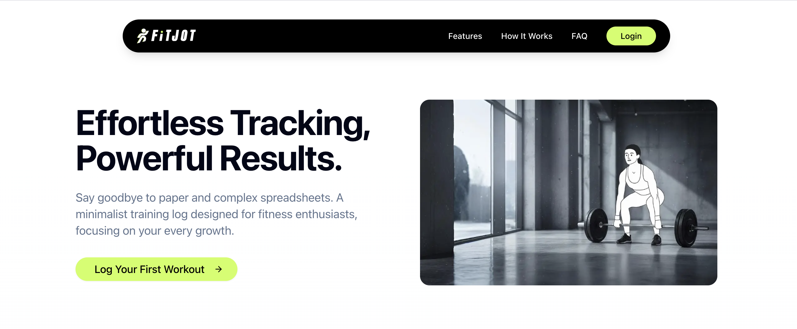
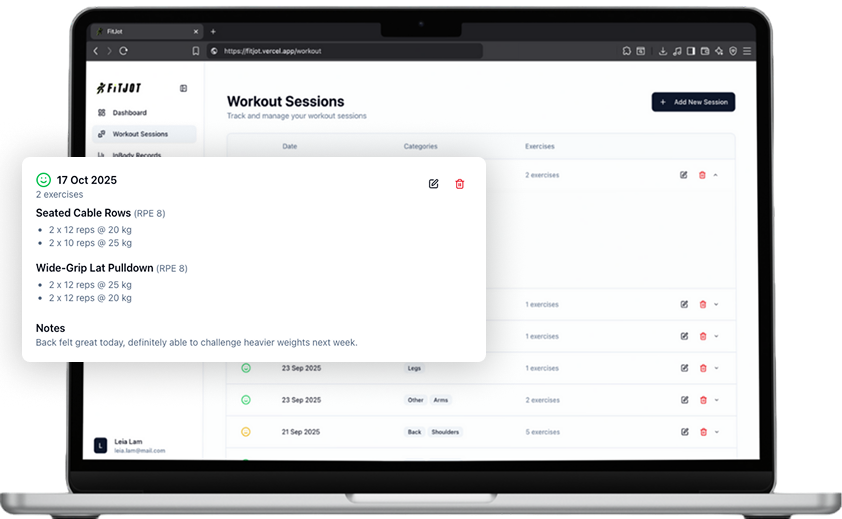
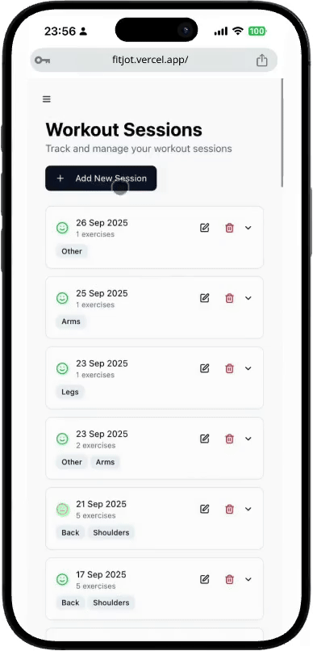

# FitJot

<div align="center">
   
   <p>
     FitJot 是一款專為簡潔與專注而設計的健身追蹤應用程式。</br>
     我們結合了訓練記錄、身體組成追蹤與進度視覺化，讓每個人都能輕鬆上手。
   </p>
</div>



<div align="center">
   <p>💪 與筆記本一樣簡單，但比試算表更強大。</br>
   🔄 對於過於複雜的健身應用程式，這是一個完美的替代方案。</br>
   🌐 https://fitjot.vercel.app
 </p>
</div>

<details>
<summary>目錄</summary>

- [功能特色](#功能特色)
- [Tech Stack](#tech-stack)
- [架構設計](#架構設計)
- [測試策略](#測試策略)
- [效能與使用者體驗](#效能與使用者體驗)
- [未來藍圖](#未來藍圖)
- [專案結構](#專案結構)

</details>

[English](README.md)

## 功能特色

- **訓練課表管理**：記錄運動項目、組數、重量與 RPE。
- **InBody 數據追蹤**：追蹤體重、體脂率與骨骼肌重量的變化。
- **800+ 運動資料庫**：整合 [wrkout/exercises.json](https://github.com/wrkout/exercises.json)。
- **即時資料同步**：採用 Firebase Firestore 搭配 React Query 快取策略，提供反應迅速的使用者介面。

</br>
</br>
</br>

<div align="center">
   &nbsp;&nbsp;&nbsp;&nbsp;&nbsp;&nbsp;
   
</div>

## 技術棧

- **前端**：
  - 採用 **Next.js 15** 與 **React 19** (App Router).
  - 面使用 **TypeScript** 進行型別定義。
  - 透過 **TanStack React Query** v5 管理伺服器狀態與快取。
- **UI 與樣式**：
  - 使用 **Tailwind CSS** v4 進行樣式設計，並搭配基於 **shadcn/ui** 的組件庫。
  - 表單處理採用 **React Hook Form**，並透過 **Zod schemas** 進行驗證。
- **後端與部署**：
  - 後端服務使用 **Firebase** 進行使用者驗證（信箱/密碼、Google OAuth）及作為 NoSQL 資料庫（Firestore）。
  - 透過 **Vercel** 實現自動化持續部署，每次 `git push` 到 `main` 分支即會自動部署。
- **測試與工具**：
  - 透過完整的測試套件維持專案高品質，包含使用 **Vitest 進行單元/整合測試**及 **Playwright 進行 e2e 測試**。
  - 程式碼一致性由 **ESLint** 強制執行，並使用 **pnpm** 管理套件。

## 架構設計

```
┌─────────────────────────────────────────────────┐
│  Vercel Edge/Serverless (Server Components)     │
│  ┌───────────────────────────────────────────┐  │
│  │ app/layout.tsx                            │  │
│  │  → Metadata                               │  │
│  │                                           │  │
│  │ app/workout/page.tsx                      │  │
│  │  → await getExercises()                   │  │
│  │  → 800+ exercises prefetched on server    │  │
│  └───────────────────────────────────────────┘  │
└─────────────────────────────────────────────────┘
              │ HTML + Serialized Data
              ▼
┌─────────────────────────────────────────────────┐
│  Client (Browser) - Client Components           │
│  ┌───────────────────────────────────────────┐  │
│  │ React Query + Context                     │  │
│  │  → Workout Sessions (user data)           │  │
│  │  → InBody Records                         │  │
│  │  → Auth State (Firebase)                  │  │
│  │                                           │  │
│  │ Interactive Components                    │  │
│  │  → SessionForm (React Hook Form)          │  │
│  │  → InBodyForm (React Hook Form)           │  │
│  │  → Dashboard (React Query)                │  │
│  └───────────────────────────────────────────┘  │
└─────────────────────────────────────────────────┘
              │ Firestore SDK
              ▼
┌─────────────────────────────────────────────────────┐
│  Firebase Backend                                   │
│  - Authentication (Email + Google OAuth)            │
│  - Firestore (access controlled by Security Rules)  │
│  - Collections: users, workout_sessions,            │
│                 in_body_data, exercises             │
└─────────────────────────────────────────────────────┘
```

## 測試策略

```
        E2E (Playwright)
       ┌──────────────┐
       │   3 Flows    │  Auth, Workout CRUD, InBody CRUD
       └──────────────┘
     ┌──────────────────┐
     │   Integration    │  DB layer testing with Firebase Emulator
     └──────────────────┘
   ┌──────────────────────┐
   │      Unit Tests      │  React Testing Library + Vitest
   └──────────────────────┘
```

### 端對端測試覆蓋範圍

| 情境            | 檔案                  | 涵蓋功能                 |
| :-------------- | :-------------------- | :----------------------- |
| **使用者認證**  | `e2e/auth.spec.ts`    | 登入、登出、重新導向     |
| **訓練 CRUD**   | `e2e/workout.spec.ts` | 新增、編輯、刪除訓練課表 |
| **InBody CRUD** | `e2e/inbody.spec.ts`  | 新增、編輯、刪除記錄     |

### 執行測試

```bash
# 單元測試
pnpm test:unit

# 整合測試 (需要 Firebase Emulator)
pnpm test:int

# 端對端測試
pnpm playwright test
```

## 效能與使用者體驗

### 已實作的優化項目

- **動態載入**：大型組件如 `InBodyForm` 與 `SessionForm` 會在需要時才進行延遲載入，以減少初始 JavaScript 套件的大小。
- **字型優化**：利用 `next/font` 自行託管字型，避免版面配置轉移並消除對 Google Fonts 的網路請求。
- **伺服器端資料擷取**：靜態資料（如大量的運動列表）會在伺服器端預先擷取。這確保了資料包含在初始的 HTML 中，避免了客戶端的資料擷取瀑布流，並改善了載入時間。
- **認證狀態持久化**：使用者認證狀態會保留在本地儲存中，讓使用者在關閉瀏覽器後仍能保持登入狀態。

## 未來藍圖

- [ ] GitHub Actions CI (部署前測試)
- [ ] Core Web Vitals 監控與優化報告
- [ ] 整合 Sentry 錯誤監控
- [ ] 資料視覺化圖表 (例如：Recharts)
- [ ] PWA 支援 (Service Worker + Manifest)
- [ ] 完整的離線支援 (Firestore Persistence)
- [ ] 使用者自訂運動項目
- [ ] 訓練計時器與工具
- [ ] 根據歷史數據提供 AI 訓練建議
- [ ] 深色模式
- [ ] 國際化 (i18n) 支援

## 專案結構

```
workout-log/
├── app/                    # Next.js App Router
│   ├── layout.tsx          # 根佈局 (伺服器元件)
│   ├── page.tsx            # 儀表板 (客戶端元件)
│   ├── workout/page.tsx    # 訓練頁面 (伺服器 + 客戶端元件)
│   ├── inbody/page.tsx     # InBody 頁面 (客戶端元件)
│   ├── login/page.tsx      # 登入頁面
│   ├── signup/page.tsx     # 註冊頁面
│   └── forgot-password/    # 忘記密碼頁面
├── components/             # React 組件
│   ├── __tests__/          # 組件測試 (單元)
│   ├── ui/                 # shadcn/ui 組件
│   ├── SessionForm.tsx     # 訓練課表表單
│   ├── InBodyForm.tsx      # InBody 資料表單
│   ├── Dashboard.tsx       # 主要儀表板
│   ├── WorkoutDashboard.tsx        # 訓練管理
│   ├── WorkoutHistoryTable.tsx     # 訓練歷史列表
│   └── InBodyHistoryTable.tsx      # InBody 記錄列表
├── lib/                    # 工具程式 & contexts
│   ├── __tests__/          # 整合測試
│   ├── firebase.ts         # Firebase 設定
│   ├── db.ts               # Firestore 操作
│   ├── AuthContext.tsx     # 認證狀態
│   ├── AppDataContext.tsx  # React Query 封裝
│   ├── types.ts            # TypeScript 型別
│   └── summary.ts          # 資料計算工具
├── e2e/                    # Playwright 測試
│   ├── auth.spec.ts        # 使用者認證端對端測試
│   ├── workout.spec.ts     # 訓練 CRUD 端對端測試
│   └── inbody.spec.ts      # InBody CRUD 端對端測試
```

---

Built with ❤️ using Next.js 15, React 19, and Firebase
